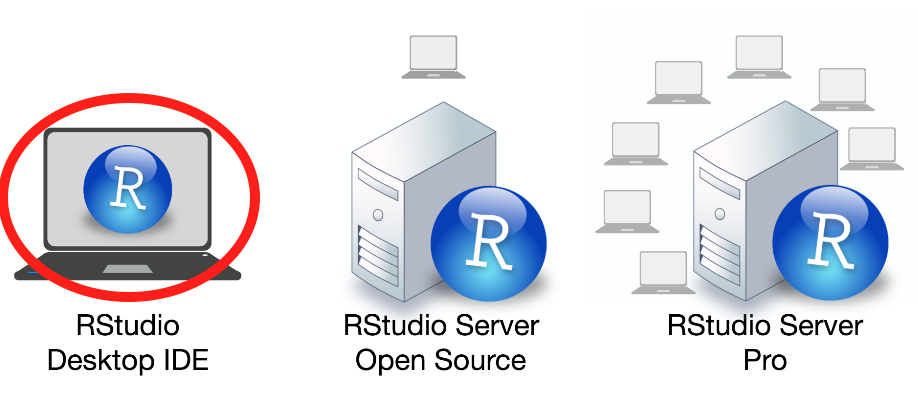
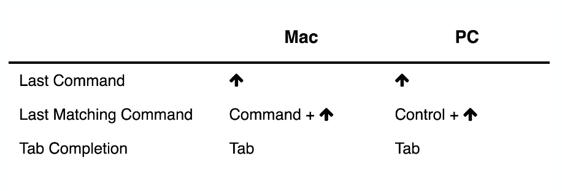
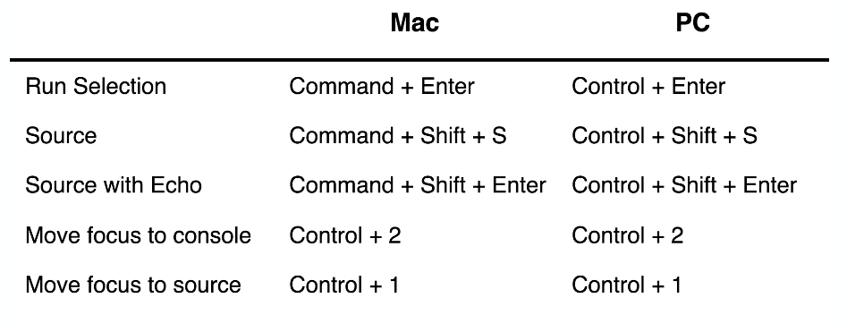

# Introducción a Herramientas 


### ¿Qué es R? {-}


```{block2, type='information'}
R es un lenguaje de programación con enfoque al análisis estadístico.
```


<br>

Además: 

- Software libre (no dice qué puedes o no hacer con el software)

- De código abierto (todo el código de R se inspecciona)

- Funcionalidad adicional está en **paquetes** que la comunidad contribuye.

<br>

```{r, fig.align='center', out.width='20%', echo=FALSE}
knitr::include_graphics("figures/Rlogo.png")
```


## R Console

```{r, fig.align='center', out.width='100%', echo=FALSE}
knitr::include_graphics("figures/rconsole.png")
```


## RStudio 


RStudio es una compañía que crea productos/software relacionados
a R.

```{r, fig.align='center', out.width='30%', echo=FALSE}
knitr::include_graphics("figures/RStudio-Logo-Blue-Gray-125.png")
```

El producto más conocido es el ambiente de desarrollo: 
**RStudioIDE (Integrated Development Environment)**

```{r, fig.align='center', out.width='80%', echo=FALSE}

```


## Descarga

Necesitamos instalar:

* R: **Comprenhensive R Archive Network** (CRAN)

https://cran.r-project.org/

* RStudio IDE

https://www.rstudio.com/products/rstudio/download/

```{r, fig.align='center', out.width='40%', echo=FALSE}
knitr::include_graphics("figures/free-download.png")
```


## RStudio Layout

```{r, fig.align='center', out.width='110%', echo=FALSE}
knitr::include_graphics("figures/console-descr.png")
```


#### Consola {-}

Escribir en línea de comandos.

```{r, fig.align='center', out.width='100%', echo=FALSE}

```

#### Código {-}

Desarrollo de código. Documento **RScript**


```{r, fig.align='center', out.width='100%', echo=FALSE}

```


#### Más shorcuts para escribir {-}


```{r, fig.align='center', out.width='100%', echo=FALSE}
knitr::include_graphics("figures/shortcuts-writting.png")
```


