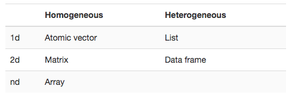

# Tipos de Datos {#tiposdatos}

En R existen cinco tipos de datos básicos:

  \@ref(vectores) Vector 
  
  \@ref(matrices) Matriz
  
  \@ref(factores) Factor
  
  \@ref(data-frame) Data frame
  
  \@ref(listas) Lista


```{r, fig.align='center', out.width='50%', echo=FALSE}
knitr::include_graphics("figures/data-estructure.png")
```


```{r, fig.align='center', out.width='90%', echo=FALSE}

```


## Vectores {#vectores}


```{block2, type='information'}
Un vector es un arreglo de una dimensión.
```


### Tipo de vectores

En R existen tres clases principales de vectores y se 
crean con la función *combine* `c()` .

- Numérico
```{r}
num_vec <- c(-1, 2.5, 3, 4, 5.1)
```

- Caracter
```{r}
cha_vec <- c("Mon", "Tue", "Wed", "Thu", "Sat", "Sun")
```

- Lógico
```{r}
boo_vec <- c(TRUE, FALSE, FALSE, TRUE, TRUE, FALSE)
```


```{block2, type='nota'}
En R se asigna el objeto a un nombre 
con: `<-`.
```


<br>

La función `class()` nos dice cuál es la clase o tipo del vector.

```{r}
class(num_vec)
```

Otra función importante es `length()` que 
nos dice cuál es la longitud del vector.

```{r}
length(num_vec)
```

<br>

#### Ej: Ganancias - Ruleta y poker {-}

Mis ganancias de poker por día de la semana son:
```{r}
poker_gan <- c(150, 178, -6, 166, -80, -119, -142)
print(poker_gan)
```

Mis ganancias en ruleta son: 

- lunes -48
- martes 151
- miércoles 198
- jueves -16
- viernes 134
- sábado -153
- domingo 126

Usando la función combine `c()` asigna
las ganancias por día al vector `ruleta_gan`.
```{r, eval = F}
ruleta_gan <- c()
print(ruleta_gan)
```

```{r, echo=FALSE}
ruleta_gan <- c(-48, 151, 198, -16, 134, -153, 126)
names(ruleta_gan) <- c("Mon", "Tue", "Wed", "Thu", "Fri", "Sat", "Sun")
```


<br>

---

### Nombres de vectores

La función `names()` nos permite nombrar 
los elementos de cada vector. 

Por ejemplo, a cada elemento de 
las ganancias de poker del ejercicio anterior,
asignaremos el nombre del día de la 
semana en que se obtuvieron. 

```{r}
dias <- c("Mon", "Tue", "Wed", "Thu", "Fri", "Sat", "Sun")
names(poker_gan) <- dias
print(poker_gan)
```


#### Ej: Días - Ruleta y poker. {-}

Asigna los nombres del día de la 
semana a cada elemento del vector de las 
ganancias de ruleta. 

```{r, eval = F}
names(ruleta_gan) <- 
print(ruleta_gan)
```

```{r, echo= F}
names(ruleta_gan) <- dias
```


<br>

---


### Selección de elementos en vectores

La selección de elementos de un vector se 
realiza indicando las posiciones 
a seleccionar entre `[ ]`.

Estas posiciones pueden 
indicarse por medio de un vector 
numérico o de caracteres si los
elementos del vector están nombrados. 


- **Vector numérico:**

```{r}
poker_gan[ c(1, 5) ]
```

La función `seq()` o el uso de dos puntos `:` permiten
crear un vector de secuencias numéricas:

```{r}
poker_gan[ 1:3 ]
poker_gan[ seq(from = 7, to = 5) ]
```


- **Nombres:** 

```{r}
poker_gan[ c("Mon", "Tue")]
```


#### Ej: Miercoles - Ruleta y poker. {-}

Extrae las ganancias de ambos juegos del día **miercoles** y 
calcula la ganancia total de ese día. 

```{r, eval = F}
wed_gan <- poker_gan[ ] + ruleta_gan[]
print(wed_gan)
```

<br>

---

### ¿Qué pasa si sumamos los días de fin de semana?

Seleccionamos únicamente los días de fin de semana
para ambos juegos. 

```{r}
poker_fin <- poker_gan[ dias[5:7] ] 
poker_fin
```

```{r}
ruleta_fin <- ruleta_gan[ 5:7 ]
ruleta_fin
```

¿Qué pasa cuando sumo los vectores?
```{r}
poker_fin + ruleta_fin
```


```{block2, type = 'information'}
**Element wise:** 
  
En R para cualquier operación (`+, -, *, /`) de vectores, 
las operaciones son elemento a elemento (element wise). 

Por ejemplo, al sumar vectores:

  - la primera posición del primer
vector se suma con la primera posicion del segundo vector,

  - la segunda posición del primer
vector se suma con la segunda posicion del segundo vector

y así sucesivamente. 
```


<br>

#### Ej: Diario - Ruleta y poker. {-}

Calcula las ganancias diarias y asígnalas al objeto
`diario_gan`. ¿Qué día se gana más y qué día se pierde más?

```{r, eval = F}
diario_gan <- 
```

Usando el vector `diario_gan` y la función 
`sum()` calcula las ganancias totales
de la semana. 

```{r, eval = F}
sum(diario_gan)
```

¿Me conviene seguir jugando?


```{r, echo = F}
diario_gan <- poker_gan + ruleta_gan
diario_gan
```


<br>

---

### Comparación de elementos

La comparación de elementos se realiza 
con los siguientes comandos: 

- `>` mayor a
- `>=` mayor o igual
- `<` menor a 
- `<=` menor o igual a 
- `==` igual a
- `!=` distinto de 
- `%in%` contenido en


Este tipo de operaciones regresan
un vector lógico dependiendo si la condición 
se cumple o no. 

```{r}
poker_gan
poker_pos <- poker_gan >= 0
print(poker_pos)
```


Este vector lógico también nos ayuda a seleccionar 
los elementos del vector que cumplen la condición.

```{r}
poker_gan[poker_pos]
```


El comando `%in%` regresa un vector lógico
si los elementos indicados están contenidos en 
el vector.

```{r}
ciudades <-  c("Aguascalientes", "Aguascalientes", 
               "Monterrey", "Monterrey", 
               "Guadalajara", 
               "Mexico", "Mexico")
ciudades_cond <- ciudades %in% c("Mexico", "Monterrey")
ciudades_cond
```

```{r}
sum(ciudades_cond)
```


<br>


Otra función importante es la función `which()`, que 
regresa las posiciones numéricas del 
vector en las que se cumple la condición:

```{r}
ciudades_pos <- which(ciudades_cond)
ciudades_pos
```

```{r}
ciudades[ciudades_pos]
```


<br>

---

### Gráfica de vectores

En R existe la función `plot()`que permite 
crear gráficas usando vectores numéricos.

```{r, fig.width=5}
plot(x = poker_gan)
```

```{r, fig.width=5, fig.height=5}
plot(x = poker_gan, y = ruleta_gan)
```

Un histograma del vector se
crea con la función `hist()`.

```{r, fig.width=5, fig.height=5}
hist(x = poker_gan)
```


<br>

---

### Vectores de distribuciones

En R existen funciones que generan vectores 
de realizaciones aleatorias
de distribuciones probabilísticas.


- Distribución Normal:
```{r, fig.width=6, fig.height=5}
norm_vec <- rnorm(n = 100, mean = 0, sd = 10)
hist(norm_vec)
```

- Distribución Uniforme:
```{r, fig.width=6, fig.height=5}
unif_vec <- runif(n = 100, min = 10, max = 100)
hist(unif_vec)
```


<br>

#### Ej: Normal {-}


Usando la función `rnorm()` genera 1000 realizaciones
de una distribución con media $\mu$ 10 y desviación
estándar $\sigma$ 5.

```{r, eval = F}
norm1000_vec <- rnorm()
```


Realiza un histograma del vector obtenido.

```{r, eval = F}
hist()
```


<br>

---

## Matrices {#matrices}

```{block2, type='information'}
Una matriz es un arreglo de dos dimensiones
en el que todos los elementos son
del mismo tipo, por ejemplo: numéricos
```


### Crear una matriz 

La función `matrix()` permite crear la
matriz de un vector especificando las dimensiones,
por ejemplo:

```{r}
matrix(data = 1:9, nrow = 3, ncol = 3, byrow = F)
```

<br>

En el siguiente vector se presentan 
los ingresos totales y de lanzamiento
de cada película de la saga Harry Potter.

[Box Office Mojo: Harry Potter](http://www.boxofficemojo.com/franchises/chart/?id=harrypotter.htm)


```{r}
sales_hp <- c(497066400, 426630300, 401608200, 399302200, 377314200, 
              359788300, 357233500, 328833900, 141823200, 189432500, 
              142414700, 135197600, 99635700, 92756000, 134119300, 
              138752100)
sales_mat <- matrix(sales_hp, nrow = 8, byrow = F)
sales_mat
```

La función `dim()` regresa la dimensión de la
matriz (renglones y columnas). 

```{r}
dim(sales_mat)
```


La función `nrow()` regresa el número de 
renglones de la matriz y `ncol()` el número 
de columnas.

```{r}
nrow(sales_mat)
```

```{r}
ncol(sales_mat)
```


<br> 

----

### Nombres de matrices 

En R es posible agregar nombres a los renglones
y columnas de una matriz con las funciones 
`colnames()` y `rownames()`. 

Considerando los siete títulos de la saga,
asignamos los títulos de las películas
a los renglones con la función `rownames()`:

```{r}
titles_hp <- c(
  "1. HP and the Sorcerer's Stone",
  "8. HP and the Deathly Hallows Part 2",
  "4. HP and the Goblet of Fire",
  "2. HP and the Chamber of Secrets",
  "5. HP and the Order of the Phoenix",
  "6. HP and the Half-Blood Prince",
  "3. HP and the Prisoner of Azkaban",
  "7. HP and the Deathly Hallows Part 1")
rownames(sales_mat) <- titles_hp
sales_mat
```


<br>

#### Ej: Tipo de ventas. {-}

Usando la función `colnames()` asigna 
el nombre del tipo de ventas 
a cada columna:

```{r, eval = F}
sales_hp <- c("total", "release_date")
colnames() <- 
sales_mat
```

```{r, echo = F}
sales_hp <- c("total", "release_date")
colnames(sales_mat) <- sales_hp
```


<br>

---

### Selección de elementos en una matriz

Al igual que un vector, los elementos de una matriz pueden seleccionarse
con un vector de posiciones o un vector de nombres. Pero, en este 
se define la posición de ambas
dimensiones, renglones y columnas  `[ , ]`.

Por ejemplo, si queremos obtener una submatriz para las 
primeras tres películas de las ventas :
```{r}
sales_mat[c(1, 4, 7), 1:2]
```

O bien:
```{r}
titles_first3 <- c("1. HP and the Sorcerer's Stone",
  "2. HP and the Chamber of Secrets",
  "3. HP and the Prisoner of Azkaban")
sales_mat[titles_first3, ]
```


```{block2, type = 'nota'}
Para seleccionar todos los
elementos de una dimensión se
deja vacía la posición. 
```


<br>


---

### Operaciones en matrices

Al igual que los vectores, las operaciones son elemento a elemento
o *element wise*.

Siguiendo con el ejemplo de ingresos, 
para facilitar la lectura de los datos
dividimos entre un millón cada valor.

```{r}
sales_mat_mill <- sales_mat/1e6
sales_mat_mill
```


Lo mismo sucede con un vector. 
Supongamos que el siguiente vector
contiene el número de cines en los que se
exhibió cada película.
```{r}
theaters_vec <- c(3672, 4375, 3858, 3682, 4285, 4325, 3855, 4125)
theaters_vec
```

Calculemos el ingreso promedio
por cada cine para el total de ingresos
y en la fecha de lanzamiento.
```{r}
sales_mat_avg <- sales_mat/theaters_vec
sales_mat_avg
```


<br>

#### Ej: Total de visitas {-}

Calcula el número de visitas si 
el costo del boleto promedio es de $8.89
dólares.

```{r, eval = F}
visits_mat <- sales_mat
visits_mat
```


```{r, echo = F}
visits_mat <- sales_mat/8.89
```


<br>

----

### Operaciones por dimensiones

En R existen funciones que permiten 
realizar operaciones 
por columnas o renglones de una matriz.

- `colSums()`

```{r}
colSums(sales_mat_mill)
```

- `rowSums()`

```{r}
rowSums(sales_mat_mill)
```


<br>

#### Ej: Ingresos promedio {-}

Usando la función `colMeans()` calcula 
el ingreso promedio 
total y en la fecha de lanzamiento.


```{r, eval = F}
avg_income <- colMeans()
```

```{r, echo = F}
avg_income <- colMeans(sales_mat)
```


<br>

---


### Nuevos valores

Existen funciones que 
nos permiten aumentar la dimensión de una 
matriz. Para columnas `cbind()`
y reglones `rbind()`.


Agreguemos el vector de número de salas
a la matriz de ingresos por millón.

```{r}
sales_mat_theat <- cbind(sales_mat_mill, theaters_vec)
sales_mat_theat
```

<br>

#### Ej: Más información {-}

Agrega un reglón a la matriz `sales_mat_theat`
con el promedio de ventas totales, 
ingresos en la fechas de lanzamientos y 
salas de exhibición.

Tip: Usa las funciones `colMeans()` y `rbind()`.
```{r, eval = F}
avg_row <- colMeans()
rbind(sales_mat_theat, )
```


<br>


---

## Factores {#factores}


```{block2, type='information'}
Un factor en R es un tipo de vector con un enfoque estadístico
que se usa para variables categóricas.

La característica de un factor es que tiene un número 
limitado de valores llamados **niveles**.

Existen dos tipos de variables categóricas: nominal u ordinal. 
En R un factor también se puden definir de esta forma.
```

Las variables categóricas son comunes
en bases de datos de encuestas.


### Variable categórica nominal

Un ejemplo de variable categórica nominal 
es el sexo de una persona: femenino (F) o 
masculino (M)

```{r}
sex_vec <- c("F", "M", "M", "F", "M")
```

En R un factor se define con la función 
`factor()`.

```{r}
sex_fct <- factor(sex_vec)
sex_fct
```

En automático define los niveles del factor y 
los ordena en orden alfabético. Si se desea cambiar
esto el argumento `levels = c()` permite asignar
un vector de niveles específico.


```{r}
sex_lev_fct <- factor(sex_vec, levels = c("M", "F"))
sex_lev_fct
```


<br>

---

### Variable categórica ordinal

Una variable categórica ordinal 
como el nombre lo dice tiene  
orden en los niveles del factor. 

Para dar orden a los niveles
en R se modifica el argumento `ordered = TRUE`
de la función `factor()`. 


Se tiene el siguiente vector de temperaturas y 
se desea crear un factor ordenado de menor temperatura
a mayor temperatura.
```{r}
temp_vec <- c("High", "Low", "Medium", "Low", 
              "Low", "Medium", "High", "Low", 
              "Medium", "Low", "Low")
temp_fct <- factor(temp_vec, 
                   levels = c("Low", "Medium", "High"), 
                   ordered = T)
temp_fct
```

Ahora los niveles tiene una jerarquía.
```{r}
levels(temp_fct)
```


Una forma de modificar las etiquetas de los niveles
es reasignando un vector.
```{r}
levels(temp_fct) <- c("L", "M", "H")
temp_fct
```


<br>

----

### Resúmen de factores

La función `summary()` permite resumir la 
información del vector. En particular para un 
factor calcula la frecuencia de cada nivel, 
lo que no sucede si es un caracter.

```{r}
summary(sex_vec)
```

```{r}
summary(sex_fct)
```


<br>

#### Ej: Analistas {-}

Se tienen 5 analistas, cada uno con 
las siguientes características de
velocidad de trabajo.

Analista 1: rápido
Analista 2: normal
Analista 3: normal
Analista 4: rápido
Analista 5: lento

1. Crea un factor ordinal de analistas
```{r, eval = F}
analistas_vec <-  c()
analistas_fct <-  factor(, 
                         levels = , 
                         ordered = )
```


2. Comprueba si el analista 2 es más rápido que el 
analista 5. Tip: es una comparación `>`.

```{r, eval = F}
analistas_vec[] > analistas_vec[]
```


```{r, echo = F}
analistas_vec <-  c("rápido","normal","normal","rápido","lento")
analistas_fct <-  factor(analistas_vec, 
                         levels = c("lento", "normal", "rápido"), 
                         ordered = T)
# analistas_vec[2] > analistas_vec[5]
```


<br>

```{block2, type = "warning"}
Este tipo de vector es importante porque
los modelos estadísticos que
desarrolles más adelante tratan diferente 
las variable numéricas y las variables categóricas.
```


<br>


---

## Dataframe {#data-frame}

```{block2, type = "information"}
Un dataframe es un objeto de dos dimensiones en R.
Puede verse como un arreglo de vectores de la misma 
dimensión, similar a una matriz. 

La ventaja de un dataframe, es que a diferencia de una 
matriz, los vectores o columnas pueden ser de diferentes
tipos.
```

En general, funcionan para guardar tablas de datos. Donde
las columnas representan variables y los renglones
observaciones. Es similar a la carga de datos 
en paquetes estadísticos como SAS y SPSS.


<br>

### Crear un dataframe

En R se crean dataframes con la función `data.frame()`.

Una forma de crear un dataframe es
asignando vectores.
```{r}
muestra_df <- data.frame(secuencia = 1:5,
                         aleatorio = rnorm(5),
                         letras = c("a", "b", "c", "d", "e"))
muestra_df
```

O bien, se pude transformar una matriz con la misma
función.
Tomemos los datos de los ingresos de las películas
de la saga de HP y hagamos una matriz.

```{r}
sales_df <- data.frame(sales_mat)
sales_df
```

<br>

---

### Nombres de dimensiones

Al igual que matrices, las funciones `rownames()` y `colnames()` 
permiten nombrar los renglones y columnas del objeto. 

```{r}
colnames(sales_df) <- c("total_grosses", "opening_grosses")
sales_df
```


<br>

----


### Seleccion de elementos

Para dataframes, ademas de seleccionar posiciones de
renglones y columnas con `[ , ]`, se puede 
usar el signo `$`.

```{r}
sales_df$total_grosses
```

Usando este mismo signo se pueden agregar
nuevas columnas al objeto. 

Por ejemplo, tomemos los títulos que se 
heredaron de la matriz como nombres de columnas.
Incluyamos una variable al dataframe de los
títulos como un factor. 

```{r}
sales_df$title <- factor(rownames(sales_df))
sales_df
```

Ahora los títulos de las películas son un 
factor con los siguientes niveles:
```{r}
levels(sales_df$title)
```


Como los títulos ya los tenemos como una variable
podemos borrar los nombres de los renglones usando `NULL`.
```{r}
rownames(sales_df) <- NULL
sales_df
```

<br>

#### Ej: Salas de cine {-}

Agrega una columna con el 
número de cines en los que se exhibió la 
película usando el vector que generamos antes `theaters_vec`.


```{r, eval = F}
sales_df$theaters <- 
sales_df
```

```{r, echo = F}
sales_df$theaters <- theaters_vec
```


<br>

----

### Orden de posiciones

La función `order()` ordena el vector 
y regresa la posición de los elementos ordenados
de menor a mayor.


Siguiendo con el ejemplo de los ingresos de la saga, 
obtengamos el vector de posiciones de 
las películas ordenado por
el total de ingresos.

El vector de total de ingresos es el siguiente:
```{r}
sales_df$total_grosses
```

El vector con las posiciones ordenadas
```{r}
total_order <- order(sales_df$total_grosses)
total_order
```

Seleccionamos las posiciones del total de ingresos
en el orden que nos dice el vector ordenado `total_order`
para obtener el vector de ingresos ordenado.
```{r}
sales_df$total_grosses[total_order]
```


De la misma forma, es posible ordenar el dataframe:
```{r}
sales_order_df <- sales_df[ total_order , c(3, 1, 2)]
sales_order_df
```


<br>

#### Ej: Fechas de lanzamiento {-}

Agrega otra columna al dataframe `sales_order_df` con las fechas de lanzamiento 
del vector que se presenta a continuación. 

```{r}
release_hp <- c("11/16/01", "7/15/11", "11/18/05", "11/15/02", "7/11/07", "7/15/09", "6/4/04", "11/19/10")
names(release_hp) <-  titles_hp
release_hp
```

Existe un problema con este vector. Tiene el orden 
de la matriz original. 

Usando la función `order()` arregla la posición del 
vector con el orden de los títulos y este vector arreglado 
inclúyelo, finalmente, al df. 

```{r, eval=FALSE}
sales_order_df$release_date <- release_hp[]
sales_order_df
```

```{r, echo=FALSE}
sales_order_df$release_date <- release_hp[total_order]
sales_order_df
```


<br>


---

### Funciones útiles para data frames

Existen algunas que ayudan a tratar dataframes.


- `head()` y `tail()`: 

```{r}
head(sales_order_df)
```


```{r}
tail(sales_order_df)
```


- `str()`

```{r}
str(sales_order_df)
```


- `dim()`, `nrow()` y `ncol()`

```{r}
nrow(sales_order_df)
```


- `subset()`

```{r}
avg_total_gr <- mean(sales_order_df$total_grosses)
subset(sales_order_df, total_grosses > avg_total_gr)
```


<br>

---

## Listas {#listas}


```{block2, type = "information"}
Una lista en R es un objeto que permite una
estructura de datos complicada, una super estructura. 
Esto porque permite reunir diferentes tipos de objetos:

  - Vectores
  - Matrices
  - Dataframes
  - Listas
  
Es decir, puede almacenar cualquier cosa. 
```

Muchas funciones que usarás en el futuro, sobre todo de modelación, 
regresan resultados de estructuras complicadas y lo almacenan en 
listas. Por ejemplo, la función `lm()`.

<br>

### Crear una lista

La función `list()` permite crear una lista. 

```{r}
ejem_list <- list(
  vector = 1:10,
  matriz = matrix(1:9, nrow = 3),
  dataframe = mtcars[1:5,]
)
ejem_list
```


<br>

---

### Nombres de elementos

Equivalente a un vector, la función `names()` permite
extraer el nombre de cada elemento de la lista.

```{r}
names(ejem_list) 
```

También permite modificar los nombres.
```{r}
names(ejem_list) <-  c("vec", "mat", "df")
ejem_list
```


La función `length()` nos
dice cuantos elementos tiene la lista.

```{r}
length(ejem_list)
```


<br>

---

### Selección de elementos en una lista

La selección de elementos de una lista puede 
realizarse de tres maneras: 

1. `[ ]`


```{r}
ejem_list[1]
```

2. `[[ ]]`

```{r}
ejem_list[[1]]
```

3. `$`

```{r}
ejem_list$vector
```

<br>

---

### Nuevos valores a la lista

Existen dos formas de agregar nuevos valores a la 
lista. 

Supongamos que deseamos agregar a la 
lista de ejemplos 
un número aleatorio de la distribución normal.

```{r}
rand_num <- rnorm(1)
rand_num
```


Una forma es usando la función combine `c()`,
similar a un vector: 
```{r}
ejem_list_random <- c(ejem_list, 
                           random = rand_num)
ejem_list_random
```


La segunda es usando el signo `$` 

```{r}
ejem_list_random$random_num <- rand_num
ejem_list_random
```


<br>

---

### Funciones útiles para listas

Algunas funciones que pueden ayudarte en un futuro 
para manipular listas son:

- `unlist()`

```{r}
unlist(ejem_list)
```

- `str()`

```{r}
str(ejem_list)
```


<br>


---

## Ejercicios 

### Ej: Hidden Figures IMDB

Usando los siguientes objetos crea una lista 
de tres elementos con nombres: director, stars y reviews.

```{r}
director_hf <- "Theodore Melfi"
stars_hf <- c( "Taraji P. Henson", "Octavia Spencer", "Janelle Monáe",
             "Kirsten Dunst", "Kevin Costner", "Jim Parsons", 
             "Mahershala Ali")
reviews_hf <- data.frame(
    scores = c(9, 6, 5, 10),
    source = c( rep("IMDB", 4) ),
    comments = c("It made for an old-fashioned movie going experience...",
                 "Evident Heroism, Hidden Doubts",
                 "OK, but very disappointing",
                 "Don't let Hidden Figures be a hidden treasure!")
    )
```

La lista se llama `hidden_figures`:

```{r, eval = F}
hidden_figures <- list(
  director = ,
  stars = ,
  reviews = 
)
str(hidden_figures)
```


```{r, echo = F}
hidden_figures <- list(
  director = director_hf,
  stars = stars_hf,
  reviews = reviews_hf
)
```


---

### Ej: Calificación promedio

Extrae los scores de la película `hidden_figures` y 
con la función `mean()` calcula el promedio. 

1. Primero deberás extraer el elemento que contiene los scores. Es un dataframe.
2. Después deberás seleccionar la columna de *scores*.
3. Por último calcular el promedio y asignarlo a `avg_reviews_hf`.


Tip: Usando la función `str()` sobre la lista ubica el nivel
en el que esta el valor *scores*.


```{r, eval = F}
reviews_df <- hidden_figures
reviews_vec <- 
avg_reviews_hf <- mean(  )
avg_reviews_hf
```

```{r, echo = F}
reviews_df <- hidden_figures$reviews
reviews_vec <- reviews_df$scores
avg_reviews_hf <- mean(reviews_vec) # 7.5
```


---

### Ej: Pesos a dolares

El siguiente vector presenta el precio de 
la gasolina en diferentes localidades. 

```{r}
gas_cdmx <- c(15.82, 15.77, 15.83, 15.23, 14.95, 15.42, 15.55)
gas_cdmx
```
"¡Demasido rápido!"
Usando la siguiente lista de tipo de cambio por mes:

- Julio: 17.3808 
- Agosto: 17.6084  
- Septiembre: 17.7659 

Crea un dataframe donde cada 
variable/columnda sea el precio en dolares 
por cada mes. 

```{r, eval = F}
gas_usd_df <- data.frame(
  julio = gas_cdmx/
  agosto = 
  septiembre = 
)
print(gas_usd_df)
```


