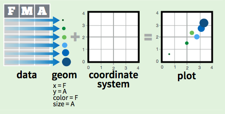

# Visualización


<br>

> "The simple graph has brought more information to the 
> data analyst’s mind than any other device." — John Tukey


<br>

### The Grammar of Graphics (gg) {-}

Wilkinson creó la "gramática de gráficas" en 2005 para describir
características que subyacen en gráficos estadísticos y 
explorar una estructura más allá de los gráficos 
nombrados (por ejemplo, 
el "diagrama de dispersión").

```{block2, type = "nota"}
Es una herramienta que nos 
permite describir concisamente los componentes
de una gráfica.
```


### ggplot2 {-}

Hadley Wickham se basa en el trabajo de Wilkinson y propone
la gramática en capas o *layered grammar of graphics* adaptado 
a R en la 
librería [`ggplot2`](http://ggplot2.tidyverse.org/).

```{r, echo = F, fig.align='center'}
knitr::include_graphics("figures/lib-ggplot2.png")
```


```{block2, type = "nota"}
`ggplot2` es una sistema para crear gráficos basado en la 
*gramática de gráficos* con los mismos elementos.
```


La gramática nos dice que un gráfico estadístico es 
un **mapeo de datos** a **atributos estéticos** 
de **objetos geométricos**, que pueden ser 
transformaciones estadísticas de los datos 
en sistemas de coordenadas específicos.


#### Descarga e instalacion {-}

Para esta sección usaremos la librería `ggplot2`:

```{r, eval=F, warning=FALSE, message=FALSE}
install.packages("ggplot2")
```

```{r, warning=FALSE, message=FALSE}
library(ggplot2)
```


```{block2, type = "warning"}
Esta librería forma partes del tidyverse, por
lo que si ya descargaste e instalaste 
la librería no necesitas volverlo a hacer.
```


```{r, warning=FALSE, message=FALSE}
library(tidyverse)
```


## Elementos

Para crear gráficos en `ggplot2` 
se requieren los siguientes elementos:

  - Datos
  - Capas
  - Escalas
  - Sistema de coordenadas
  - *Faceting*
  - Temas

Estos elementos se incluyen por medio de funciones y 
argumentos que se explicarán a continuación. 


### Base

Existen tres componentes básicos en 
`ggplot2`:

1. `data` Dataframe de datos a graficar.
2. `aes` *aesthetic mappings*. Mapeo
de las variables del conjunto de datos y la propiedades visuales
a valores estéticos de la gráfica.
3. `geoms` Al menos una capa con objetos geométricos que 
describan como tratar cada observación.


```{r, echo = F, fig.align='center'}
knitr::include_graphics("figures/ggplot-component1.png")
```

<br>


Para entender el lenguaje, usaremos el conjunto de datos pre cargado `mpg`
que tiene información sobre el 
consumo de combustible en modelos populares de automóviles.

```{r}
str(mpg)
```


#### Capa principal {-}

```{block2, type = "nota"}
La función `ggplot()` ayuda definir la capa
principal de los datos a 
mapear y los atributos estéticos principales. 
```

En este caso definimos los datos 
fuente `data = mpg` y se agregan los valores 
estéticos de los ejes `x = displ` y `y = hwy`.

```{r}
ggplot(data = mpg, mapping = aes(x = displ, y = hwy)) 
```

Esta gráfica muestra la capa principal en la que el 
*eje x* muestra el desplazamiento del motor en litros
(`displ`)

```{r}
summary(mpg$displ)
```

y el *eje y* el rendimiento de gasolina por millas en carretera
(`hwy`).

```{r}
summary(mpg$hwy)
```

<br>


```{block2, type = "warning"}
El sistema de coordenadas por defecto en `ggplot2` es 
el plano cartesiano. 
```


Sobre esta capa principal es posible
agregar más capas. En particular, se agregará 
una capa de objetos geométricos.


#### Capa de objetos geométricos {-}

Ahora, buscamos hacer un gráfico de 
dispersión, por lo que es necesario agregar una capa 
de **objetos geométricos** que mapee cada 
observación como un punto con
la función `geom_point()`.

```{block2, type = "comentario"}
**Layers**

Con el signo **`+`** agregamos capas al gráfico.
```


```{r}
ggplot(data = mpg, mapping = aes(x = displ, y = hwy)) + 
  geom_point() 
```


<br>

En resumen, producimos una gráfica de dispersión 
definida por los componentes:

1. Datos: dataframe `data = mpg`.
2. Mapeo estético: `aes(x = displ` y `y = hwy)`.
3. Objeto geométrico: `+ geom_point()`.


<br>


### Colores, formas y tamaños

Para agregar variables adicionales a la gráfica
se pueden usar más valores estéticos como: color, 
forma y tamaño.


```{r, echo = F, fig.align='center'}

```


```{block2, type = "comentario"}
Estos valores estéticos se agregan a la
capa con la función `aes()`. 
```


Siguiendo el ejemplo del gráfico de 
dispersión anterior, ahora
se quiere incluir la variable clase de automóvil (`class`)
como un valor estético de color.

```{r}
table(mpg$class)
```

```{r}
ggplot(mpg, aes(x = displ, y = hwy,
                color = class)) + 
  geom_point() 
```

Esto le da un color a cada punto u observación dependiendo de la 
clase de automóvil al que pertenece. La leyenda del lado derecho
indica que color representa cada valor de la variable `class`.

<br>

El mapeo de los atributos estéticos depende del tipo de variable, las 
variables categóricas se mapean a 
distintas escalas que las variables continuas:

&nbsp;    |Categórica      |Continua
----------|--------------|---------
Color     |Arcoiris de colores         |Gradiente de colores
Tamaño    |Escala discreta de tamaños  |Mapeo lineal entre el radio y el valor
Forma     |Distintas formas            |No aplica


<br>


## Geoms

Existen muchos objetos geométricos para diferentes
tipos de gráficas dependiendo del tipo de variable
a graficar.

En la [referencia de ggplot](http://ggplot2.tidyverse.org/reference/)
se presenta una descripción de los 
elementos disponibles en `ggplot2` así como 
otras características que no se tratarán 
en este taller.

A continuación, se presentan algunos ejemplos
de gráficos comunes.


<br>

---

### Suavizamiento

En este caso, se busca agregar una
línea *suavizada* o tendencia al
gráfico de dispersión anterior.

Este objeto geométrico ajusta un modelo para suavizar 
las observaciones. En el caso del ejemplo, por defecto 
ajusta un modelo no paramétrico llamado loess. La
función para realizar esto es `geom_smooth()`.

```{r}
ggplot(mpg, aes(x = displ, y = hwy)) + 
  geom_point() + 
  geom_smooth()
```

Sin embargo, esto se puede modificar 
a un método de regresión lineal `lm`.

```{r}
ggplot(mpg, aes(x = displ, y = hwy)) + 
  geom_point() + 
  geom_smooth(method = "lm")
```


<br>

---

### Boxplot

El gráfico de caja y brazos o *boxplot* se
crea con la función `geom_boxplot()`. 

```{block2, type = "nota"}
**Boxplot**

El gráfico compara una variable categórica y 
una numérica.
```

En este caso se gráfica el rendimiento de gasolina
en carretera (hwy) por cada tipo de auto (class).

```{r, fig.keep='all'}
ggplot(mpg, aes(x = class, y = hwy)) + 
  geom_boxplot(width = .3)
```


El gráfico de violín es muy parecido pero muestra la 
distribución de las observaciones. La función 
para este objeto geométrico es `geom_violin()`.

En este caso
se agrega otro mapeo estético `fill = class`
que indica que cada gráfico de violín debe 
tener un color de relleno por clase de auto.

```{r, fig.keep='all'}
ggplot(mpg, aes(class, hwy)) + 
  geom_violin(aes(fill = class))
```

En ggplot es posible juntar ambos 
gráficos aprovechando la funcionalidad 
de *capas*.

```{r, fig.keep='all'}
ggplot(mpg, aes(class, hwy)) + 
  geom_violin(aes(fill = class)) +
  geom_boxplot(width = .3) 
```


<br>

---

### Histogramas

El objeto geométrico para crear histogramas
es `geom_histogram()`. 

```{block2, type = "nota"}
**Histogramas**

Los histogramas muestran la distribución de una 
variable numérica.

Consiste en cortar la variable y contar el número de observaciones
en cada corte.
```


En la función es posible controlar el número 
de cortes con el argumento `bins`. Se recomienda 
probar diferentes números de cortes dependiendo de la 
variable.

En el siguiente ejemplo se muestra el
histograma del rendimiento de gasolina
en carretera (hwy) con 5 cortes. 

```{r}
ggplot(mpg, aes(hwy)) + 
  geom_histogram(bins = 5)
```


O bien, con 20 cortes:

```{r}
ggplot(mpg, aes(hwy)) + 
  geom_histogram(bins = 20)
```

<br>

También es posible obtener una estimación de 
la densidad de la variable. Puede entenderse
como un suavizamiento del histograma. 

La función de este objeto geométrico es `geom_density()`

```{r}
ggplot(mpg, aes(hwy)) + 
  geom_density( color = "blue")
```


<br>

----

### Barras

Las gráficas de barras se generan con el 
objeto `geom_bar()`. 

Este es uno de los objetos
que hacen transformaciones estadísticas, en este caso 
en particular conteos.

En la siguiente gráfica se obtiene
el conteo de observaciones en 
por tipo de automóvil (class).

```{r}
ggplot(mpg, aes(class)) + 
  geom_bar(stat = "count")
```

Otra forma de obtener el mismo gráfico
es usando la técnica *split-apply-combine*.

```{r}
tab <- mpg %>% 
  group_by(class) %>% 
  summarise(freq = n())
tab %>% head
```


```{r}
ggplot(tab, aes(x = class, y = freq)) +
  geom_bar(stat = "identity")
```


<br>

---


### Series de tiempo

En este tipo de gráficos se presenta la 
evolución de una variable en una medida temporal, como
mes, año, día. 


Este gráfico usa la base de datos pre cargada 
en `ggplot2` llamada `economics`. Esta base contiene información 
económica de Estados Unidos en el tiempo.

```{r}
str(economics)
```

Una variable debe ser la variable temporal que en 
este caso abarca desde el 1 de julio de 1967 hasta
1 de abril de 2015.

```{r}
class(economics$date)
```

```{r}
summary(economics$date)
```

En la siguiente gráfica se presenta la tasa de desempleo (unemploy)
por población (pop) desde 1967 hasta 2015.

```{r}
ggplot(economics, aes(date, unemploy/pop)) + 
  geom_line()
```

<br>

---

### Información estadística

Los siguientes objetos `stat_...()`
resumen información estadística 
con distintas transformaciones. 

A continuación se presentan los siguientes 
gráficos:

- Gráficos qq-plot
- Distribución acumulada
- Funciones de probabilidad
- Funciones auto determinadas

<br>

---

#### QQ-Plot {-}

`stat_qq`

Realiza una gráfica cuantil-cuantil de 
una muestra y la distribución teórica. Por defecto
compara los cuantiles teóricos de la distribución
normal. 

```{r}
tab <-  data.frame(
  simulación = rexp(300, rate = 5)
)
ggplot(tab, aes(sample = simulación)) + 
      stat_qq()
```

En el siguiente ejemplo se modifica para 
comparar con los cuantiles teóricos de la distribución 
exponencial. 

```{r}
ggplot(tab, aes(sample = simulación)) + 
      stat_qq(distribution = qexp, 
              dparams = 5) 
```


<br> 

---

#### Distribución acumulada {-}

`stat_ecdf`

Este objeto realiza las transformaciones 
necesarias para presentar la distribución acumulada
de una muestra.

En la siguiente gráfica se compara
la distribución de simulaciones normales con distintos
parámetros.


```{r}
df <- data.frame(x = c(rnorm(n = 100, mean = 0, sd = 3), 
                       rnorm(n = 100, mean = 0, sd = 10)),
                 g = gl(n = 2, k = 100))
ggplot(df, aes(x, colour = g)) + 
  stat_ecdf()
```


<br>

---

#### Función auto determinada  {-}


`stat_function`

Este objeto permite graficar funciones auto determinadas 
en un rango específico.

La siguiente gráfica
muestra una función predeterminada del 
objeto estadístico `dnorm`, que es la distribución
normal con media 2 y desviación 0.5.


```{r}
ggplot(data.frame(x = c(-5, 7)), aes(x)) + 
  stat_function(fun = dnorm, 
                args = list(mean = 2, sd = .5))
```


#### Distribución de función específica  {-}


`stat_function()` 

Es posible graficar cualquier función en un rango
específico determinado por nosotros. 

En este ejemplo buscamos graficar la siguiente
función:

```{r}
sin_2_fun <- function(x){
  sin(x)^2
}
```

En el rango de -10 a 10 definido como dataframe, 
la función `stat_function()` evaluará la función `sin_2_fun`
definida antes en el rango.

```{r}
ggplot(data = data.frame(x = c(-10, 10)), 
       aes(x = x)) + 
  stat_function(fun = sin_2_fun, size = 1, color = 'salmon')
```


O bien, con funciones predeterminadas en R, como la
función `dnorm()` 
donde los argumentos se especifican en una lista. 

```{r}
ggplot(data.frame(x = c(-5, 7)), aes(x)) + 
  stat_function(fun = dnorm, 
                args = list(mean = 2, sd = .5))
```


## Quick plots

Existe una opción para hacer gráficas rápidas: `qplot()`

```{block2, type = "nota"}
`qplot()` crea gráficos "rápidos" o *quick plots* que permiten
graficar de forma muy sencilla y similar a `plot`.
```

A continuación se presentan dos formas de rehacer 
el gráfico de dispersión del desplazamiento 
del motor (displ) y el rendimiento de gasolina 
en carretera (hwy).

```{r}
qplot(x = displ, y = hwy, data = mpg)
```

```{r}
qplot(x = mpg$displ, y = mpg$hwy)
```


---

## Ejercicios


- Recrea el código de R para generar las siguientes
gráficas.

```{r fig.keep='all', echo=F, fig.width=4, fig.height=2.5, fig.align='center', message=FALSE}
ggplot(mpg, aes(displ, hwy)) + 
  geom_point() + 
  geom_smooth() + 
  ggtitle('1a')

ggplot(mpg, aes(displ, hwy, group = drv)) + 
  geom_point() +
  geom_smooth(se = F) + 
  ggtitle('1b')

ggplot(mpg, aes(displ, hwy)) + 
  geom_point(aes(colour = drv)) +
  geom_smooth() + 
  ggtitle('1c')

ggplot(mpg, aes(displ, hwy, color = drv)) + 
  geom_point() +
  geom_smooth(method = 'lm', aes(linetype = drv))+ 
  ggtitle('1d')
```


---

## Referencias


- **R for Data Science**. Capítulo 3 Data visualisation. 
G. Growlemund and H. Wickham. 1st Edition. O'Reilly J. 2016.
http://r4ds.had.co.nz/data-visualisation.html

- **The Grammar of Graphics**. 
L. Wilkinson. 2nd Edition. Springer. 2016.
http://www.springer.com/gp/book/9780387245447


- **ggplot2: Elegant Graphics for Data Analysis**. 
H. Wickham. 2nd Edition. Springer. 2016.

- Referencia de objetos de ggplot2.
http://ggplot2.tidyverse.org/reference/

- **Data Visualization with ggplot2**. Rstudio Resources. Agosto 2016. https://www.rstudio.com/wp-content/uploads/2015/03/ggplot2-cheatsheet.pdf

- **Data Visualization Cheat Sheet**. Rstudio Resources. Noviembre 2016.
https://www.rstudio.com/resources/cheatsheets/