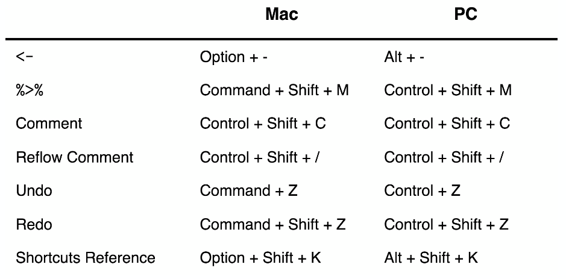

# Introducción a Herramientas 

### ¿Qué es R? {-}

\BeginKnitrBlock{information}
R es un lenguaje de programación con enfoque al análisis estadístico.
\EndKnitrBlock{information}

 

Además: 

- Software libre (no dice qué puedes o no hacer con el software)

- De código abierto (todo el código de R se inspecciona)

- Funcionalidad adicional está en **paquetes** que la comunidad contribuye.

 

## R Console

## RStudio 

RStudio es una compañía que crea productos/software relacionados
a R.

El producto más conocido es el ambiente de desarrollo: 
**RStudioIDE (Integrated Development Environment)**

## Descarga

Necesitamos instalar:

* R: **Comprenhensive R Archive Network** (CRAN)

https://cran.r-project.org/

* RStudio IDE

https://www.rstudio.com/products/rstudio/download/

## RStudio Layout

#### Consola {-}

Escribir en línea de comandos.

#### Código {-}

Desarrollo de código. Documento **RScript**

#### Más shorcuts para escribir {-}

