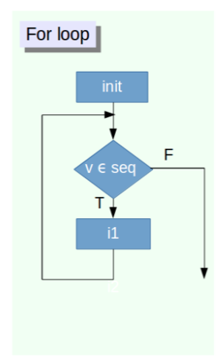

# Iteraciones 

\BeginKnitrBlock{nota}<div class="nota">**Definición:** Acto de repetir un proceso con la 
intención de alcanzar un objetivo o resultado. 

Replica *automatizada* de instrucciones. 

A cada repetición del proceso se le denomina una **iteración**.

*Looping*, *ciclar*, *iterar*</div>\EndKnitrBlock{nota}


<br>

Existen dos tipos de iteraciones o loops:

- `For`: iteración condicionada a repetirse un
número de veces fijo, controlado por un
contador o índice que se incrementa con cada ciclo.





```r
for(k in 1:5){
  print( paste("Iteración", k) )
}
```

```
## [1] "Iteración 1"
## [1] "Iteración 2"
## [1] "Iteración 3"
## [1] "Iteración 4"
## [1] "Iteración 5"
```


- `While`:  iteración limitada a repetirse hasta que se 
cumple una condición lógica.


```r
k <- 1
while(k <= 5){
  print( paste("Iteración", k) )
  k <-  k + 1
}
```

```
## [1] "Iteración 1"
## [1] "Iteración 2"
## [1] "Iteración 3"
## [1] "Iteración 4"
## [1] "Iteración 5"
```


## For loop y familia Apply 

La familia de funciones **apply** pertence a la librería `base` en R y
facilitan la manipulación de datos de forma repetitiva.

Las funciones de esta familia son: [apply()], 
[lapply()], [sapply()], `vapply()`, `mapply()`, 
`rapply()`, and `tapply()`.

\BeginKnitrBlock{comentario}<div class="comentario">La estructura de los datos de entrada y el formato del resultado o salida
determinarán cual función usar. </div>\EndKnitrBlock{comentario}

En este taller solo se verán las primeras tres funciones. 

---

### apply()

Esta es la función que manipula arreglos homogeneos, en particular, 
se revisa el caso de matrices que son arreglos de dos dimensiones.

La función tiene los siguientes argumentos:
`apply(X, MARGIN, FUN, ...)`

- `X` representa el arreglo de dos dimensiones.
- `MARGIN` representa la dimensión sobre la que 
se va a resumir la información. Donde **1 = renglon o primera dimensión** y 
**2 = columna o segunda dimensión**.
- `FUN` representa la función que resume la información.


Tomemos la siguiente matriz de simulaciones

```r
set.seed(1)
mat_norm <- matrix(rnorm(24, mean = 0, sd = 1), nrow = 4, ncol = 6)
mat_norm
```

```
##            [,1]       [,2]       [,3]        [,4]        [,5]        [,6]
## [1,] -0.6264538  0.3295078  0.5757814 -0.62124058 -0.01619026  0.91897737
## [2,]  0.1836433 -0.8204684 -0.3053884 -2.21469989  0.94383621  0.78213630
## [3,] -0.8356286  0.4874291  1.5117812  1.12493092  0.82122120  0.07456498
## [4,]  1.5952808  0.7383247  0.3898432 -0.04493361  0.59390132 -1.98935170
```

<br>

**Deseamos obtener la suma 
de cada columna de la matriz.**

<br>

El primer metodo, quizá el mas intuitivo en este momento, es 
obtener cada elemento o columna, aplicar la función a cada elemento 
y concantenar:

```r
prom_col_m1 <- c(sum(mat_norm[, 1]), 
                 sum(mat_norm[, 2]), 
                 sum(mat_norm[, 3]), 
                 sum(mat_norm[, 4]),
                 sum(mat_norm[, 5]),
                 sum(mat_norm[, 6]))
prom_col_m1
```

```
## [1]  0.3168417  0.7347931  2.1720174 -1.7559432  2.3427685 -0.2136730
```


Segundo metodo

```r
prom_col_m2 <- vector( length = ncol(mat_norm))
for(j in 1:ncol(mat_norm)){
  prom_col_m2[j] <- sum(mat_norm[, j])
}
prom_col_m2
```

```
## [1]  0.3168417  0.7347931  2.1720174 -1.7559432  2.3427685 -0.2136730
```

Tercer metodo


```r
prom_col_m3 <- apply(X = mat_norm, MARGIN = 2, FUN = sum)
prom_col_m3
```

```
## [1]  0.3168417  0.7347931  2.1720174 -1.7559432  2.3427685 -0.2136730
```


Cuarto método

```r
prom_col_m4 <- colSums(mat_norm)
prom_col_m4
```

```
## [1]  0.3168417  0.7347931  2.1720174 -1.7559432  2.3427685 -0.2136730
```


<br>

Ahora, para obtener la suma
por renglón usando el tercer método de la función
`apply()`, únicamente 
es necesario cambiar la dimensión sobre
la que voy a resumir con el argumento `MARGIN = 1`.


```r
prom_row_m3 <- apply(mat_norm, 1, sum)
prom_row_m3
```

```
## [1]  0.5603818 -1.4309408  3.1842987  1.2830648
```

Que es equivalente al primer método que usamos.

```r
prom_row_m1 <- c(sum(mat_norm[1, ]), 
                 sum(mat_norm[2, ]), 
                 sum(mat_norm[3, ]), 
                 sum(mat_norm[4, ]))
prom_row_m1
```

```
## [1]  0.5603818 -1.4309408  3.1842987  1.2830648
```


La ventaja de usar la función `apply()` es que 
se puede usar cualquier función.
Por ejemplo, obtener la desviación 
estándar.

```r
apply(mat_norm, 1, sd)
```

```
## [1] 0.6341809 1.1718660 0.8338847 1.2066403
```


O bien, una crear una función propia (definida por el usuario) con 
la función `function()`

```r
cv_vec_m3 <- apply(mat_norm, 1, function(reng){
  cv <- mean(reng)/sd(reng)
  return(cv)
})
cv_vec_m3
```

```
## [1]  0.1472718 -0.2035131  0.6364386  0.1772228
```

\BeginKnitrBlock{nota}<div class="nota">**Funciones Anónimas:**

A este tipo de funciones se les llama
**funciones anónimas** porque no se nombran ni guardan en
el ambiente de R
y únicamente funcionan dentro del
comando que las llama.</div>\EndKnitrBlock{nota}


---

### lapply()

La función `lapply()` aplica una función sobre
una lista o un vector y regresa el resultado en 
otra lista.


Usando el vector de ciudades,

```r
ciudades_vec <- c("Aguascalientes", "Monterrey", "Guadalajara", "México")
ciudades_vec
```

```
## [1] "Aguascalientes" "Monterrey"      "Guadalajara"    "México"
```


```r
res_nchar_l <- lapply(ciudades_vec, nchar)
res_nchar_l
```

```
## [[1]]
## [1] 14
## 
## [[2]]
## [1] 9
## 
## [[3]]
## [1] 11
## 
## [[4]]
## [1] 6
```


\BeginKnitrBlock{comentario}<div class="comentario">Esta función permite implementar funciones que regresen
objetos de diferentes tipos, porque la listas permiten
almacenar contenido heterogéneo.</div>\EndKnitrBlock{comentario}


<br>

---

### sapply()


La función `sapply()` aplica una función sobre
una lista o un vector y regresa el resultado en 
un arreglo.

\BeginKnitrBlock{comentario}<div class="comentario">El nombres de esta función surge de __*simplified apply*__ porque
simplifica el resultado en arreglos de una o dos dimensiones. </div>\EndKnitrBlock{comentario}


```r
res_nchar_s <- sapply(ciudades_vec, nchar)
res_nchar_s
```

```
## Aguascalientes      Monterrey    Guadalajara         México 
##             14              9             11              6
```


\BeginKnitrBlock{warning}<div class="warning">Esta función es *peligrosa* ya que únicamente simplifica
la estructura del resultado
cuando es posible, de lo contrario, regresará una lista
igual que `lapply()`.</div>\EndKnitrBlock{warning}


---

## While Loop

Implementar un proceso hasta que una condición se cumpla


```r
ctr <- 0
while(ctr <= 7){
  
  print( paste("El valor de ctr", ctr))
  print( paste("El resultado de la condicion", ctr <= 7))
  print(ctr)
  
  ctr = ctr + 1
}
```

```
## [1] "El valor de ctr 0"
## [1] "El resultado de la condicion TRUE"
## [1] 0
## [1] "El valor de ctr 1"
## [1] "El resultado de la condicion TRUE"
## [1] 1
## [1] "El valor de ctr 2"
## [1] "El resultado de la condicion TRUE"
## [1] 2
## [1] "El valor de ctr 3"
## [1] "El resultado de la condicion TRUE"
## [1] 3
## [1] "El valor de ctr 4"
## [1] "El resultado de la condicion TRUE"
## [1] 4
## [1] "El valor de ctr 5"
## [1] "El resultado de la condicion TRUE"
## [1] 5
## [1] "El valor de ctr 6"
## [1] "El resultado de la condicion TRUE"
## [1] 6
## [1] "El valor de ctr 7"
## [1] "El resultado de la condicion TRUE"
## [1] 7
```


Break statement `break()`


```r
ctr <- 1
while(ctr <= 7){
  print( paste("El valor de ctr", ctr))
  print( paste("El resultado de la condicion", ctr <= 7))
  
  if((ctr %% 5) == 0){
    break()
  }
  ctr = ctr + 1
}
```

```
## [1] "El valor de ctr 1"
## [1] "El resultado de la condicion TRUE"
## [1] "El valor de ctr 2"
## [1] "El resultado de la condicion TRUE"
## [1] "El valor de ctr 3"
## [1] "El resultado de la condicion TRUE"
## [1] "El valor de ctr 4"
## [1] "El resultado de la condicion TRUE"
## [1] "El valor de ctr 5"
## [1] "El resultado de la condicion TRUE"
```


---

## Ejercicios

