# Visualización


<br>

> "The simple graph has brought more information to the 
> data analyst’s mind than any other device." — John Tukey


<br>

### The Grammar of Graphics (gg) {-}

Wilkinson creó la "gramática de gráficas" en 2005 para descibir
características que subyacen en gráficos estadísticos y 
explorar una estructura más allá de los gráficos 
nombrados (por ejemplo, 
el "diagrama de dispersión").

\BeginKnitrBlock{nota}<div class="nota">Es una herramienta que nos 
permite describir concisamente los componentes
de una gráfica.</div>\EndKnitrBlock{nota}


### ggplot2 {-}

Hadley Wickham se basa en el trabajo de Wilkinson y propone
la gramática en capas ó *layered grammar of graphics* adaptado 
a R en la 
librería [`ggplot2`](http://ggplot2.tidyverse.org/).

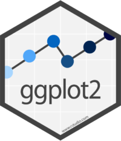


\BeginKnitrBlock{nota}<div class="nota">`ggplot2` es una sistema para crear gráficos basado en la 
*gramática de gráficos* con los mismos elementos.</div>\EndKnitrBlock{nota}


La gramática nos dice que un gráfico estadístico es 
un **mapeo de datos** a **atributos estéticos** 
de **objetos geométricos**, que pueden ser 
transformaciones estadísticas de los datos 
en sistemas de coordenadas específicos.


#### Descarga e instalacion {-}


```r
install.packages("ggplot2")
```


```r
library(ggplot2)
```


## Elementos

Para crear gráficos en `ggplot2` 
se requieren los siguientes elementos:

  - Datos
  - Capas
  - Escalas
  - Sistema de coordenadas
  - *Faceting*
  - Temas

Estos elementos se incluyen por medio de funciones y 
argumentos que se explicarán a continuación. 


### Base

Existen tres componentes básicos en 
`ggplot2`:

1. `data` Dataframe de datos a graficar.
2. `aes` *aesthetic mappings*. Mapeo
de las variables del conjunto de datos y la propiedades visuales
a valores estéticos de la gráfica.
3. `geoms` Al menos una capa con objetos geométricos que 
describan como tratar cada observación.


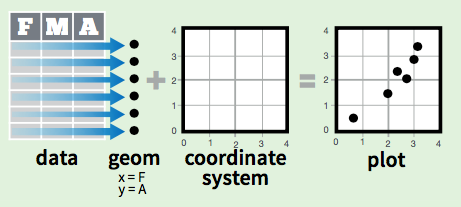

<br>


Para entender el lenguage, usaremos el conjunto de datos precargado `mpg`
que tiene información sobre el 
consumo de combustible en modelos populares de automoviles.


```r
str(mpg)
```

```
## Classes 'tbl_df', 'tbl' and 'data.frame':	234 obs. of  11 variables:
##  $ manufacturer: chr  "audi" "audi" "audi" "audi" ...
##  $ model       : chr  "a4" "a4" "a4" "a4" ...
##  $ displ       : num  1.8 1.8 2 2 2.8 2.8 3.1 1.8 1.8 2 ...
##  $ year        : int  1999 1999 2008 2008 1999 1999 2008 1999 1999 2008 ...
##  $ cyl         : int  4 4 4 4 6 6 6 4 4 4 ...
##  $ trans       : chr  "auto(l5)" "manual(m5)" "manual(m6)" "auto(av)" ...
##  $ drv         : chr  "f" "f" "f" "f" ...
##  $ cty         : int  18 21 20 21 16 18 18 18 16 20 ...
##  $ hwy         : int  29 29 31 30 26 26 27 26 25 28 ...
##  $ fl          : chr  "p" "p" "p" "p" ...
##  $ class       : chr  "compact" "compact" "compact" "compact" ...
```


#### Capa principal {-}

\BeginKnitrBlock{nota}<div class="nota">La función `ggplot()` ayuda definir la capa
principal de los datos a 
mapear y los atributos estéticos principales. </div>\EndKnitrBlock{nota}

En este caso definimos los datos 
fuente `data = mpg` y se agregan los valores 
estéticos de los ejes `x = displ` y `y = hwy`.


```r
ggplot(data = mpg, mapping = aes(x = displ, y = hwy)) 
```


Esta gráfica muestra la capa principal en la que el 
*eje x* muestra el desplazamiento del motor en litros
(`displ`)


```r
summary(mpg$displ)
```

```
##    Min. 1st Qu.  Median    Mean 3rd Qu.    Max. 
##   1.600   2.400   3.300   3.472   4.600   7.000
```

y el *eje y* el rendimiento de gasolina por millas en carretera
(`hwy`).


```r
summary(mpg$hwy)
```

```
##    Min. 1st Qu.  Median    Mean 3rd Qu.    Max. 
##   12.00   18.00   24.00   23.44   27.00   44.00
```

<br>


\BeginKnitrBlock{warning}<div class="warning">El sistema de coordenadas por defecto en `ggplot2` es 
el plano cartesiano. </div>\EndKnitrBlock{warning}


Sobre esta capa principal es posible
agregar más capas. En particular, se agregará 
una capa de objetos geométricos.


#### Capa de objetos geométricos {-}

Ahora, buscamos hacer un gráfico de 
dispersión, por lo que es necesario agregar una capa 
de **objetos geométricos** que mapeé cada 
observación como un punto con
la función `geom_point()`.

\BeginKnitrBlock{comentario}<div class="comentario">**Layers**

Con el signo **`+`** agregamos capas al gráfico.</div>\EndKnitrBlock{comentario}


```r
ggplot(data = mpg, mapping = aes(x = displ, y = hwy)) + 
  geom_point() 
```


<br>

En resúmen, producimos una gráfica de dispersión 
definida por los componentes:

1. Datos: data frame `data = mpg`.
2. Mapeo estético: `aes(x = displ` y `y = hwy)`.
3. Objeto geométrico: `+ geom_point()`.


<br>


### Colores, formas y tamaños

Para agregar variabales adicionales a la gráfica
se pueden usar más valores estéticos como: color, 
forma y tamaño.


\BeginKnitrBlock{comentario}<div class="comentario">Estos valores estéticos se agregan a la
capa con la función `aes()`. </div>\EndKnitrBlock{comentario}


Siguiendo el ejemplo del gráfico de 
dispersión anterior, ahora
se quiere incluir la variable clase de automóvil (`class`)
como un valor estético de color.


```r
table(mpg$class)
```

```
## 
##    2seater    compact    midsize    minivan     pickup subcompact 
##          5         47         41         11         33         35 
##        suv 
##         62
```


```r
ggplot(mpg, aes(x = displ, y = hwy,
                color = class)) + 
  geom_point() 
```


Esto le da un color a cada punto u observación dependiendo de la 
clase de automóvil al que pertenece. La leyenda del lado derecho
indica que color representa cada valor de la variable `class`.

<br>

El mapeo de los atributos estéticos depende del tipo de variable, las 
variables categóricas se mapean a 
distintas escalas que las variables continuas:

&nbsp;    |Categórica      |Continua
----------|--------------|---------
Color     |Arcoiris de colores         |Gradiente de colores
Tamaño    |Escala discreta de tamaños  |Mapeo lineal entre el radio y el valor
Forma     |Distintas formas            |No aplica


<br>


## Geoms

### Suavizamiento


```r
ggplot(mpg, aes(x = displ, y = hwy)) + 
  geom_point() + 
  geom_smooth()
```

```
## `geom_smooth()` using method = 'loess'
```


```r
ggplot(mpg, aes(x = displ, y = hwy)) + 
  geom_point() + 
  geom_smooth(method = "lm")
```

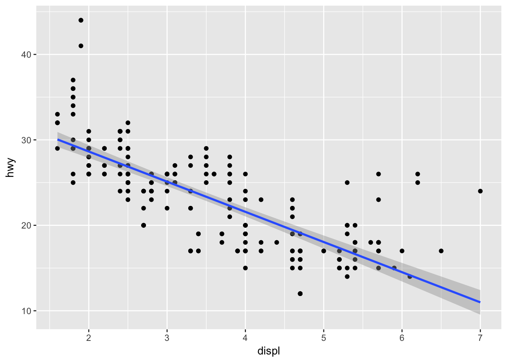


### Boxplot


```r
ggplot(mpg, aes(drv, hwy)) + 
  geom_boxplot(width = .3)
```

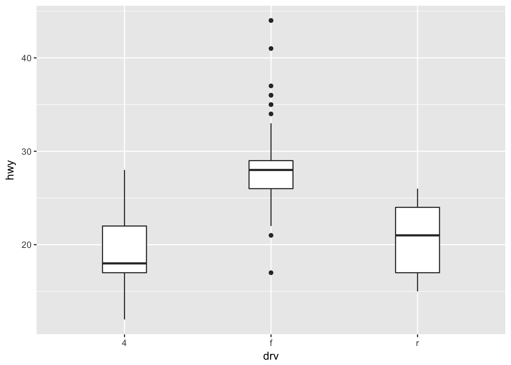


```r
ggplot(mpg, aes(drv, hwy)) + 
  geom_violin(aes(fill = drv))
```


```r
ggplot(mpg, aes(drv, hwy)) + 
  geom_violin(aes(fill = drv)) +
  geom_boxplot(width = .3) 
```

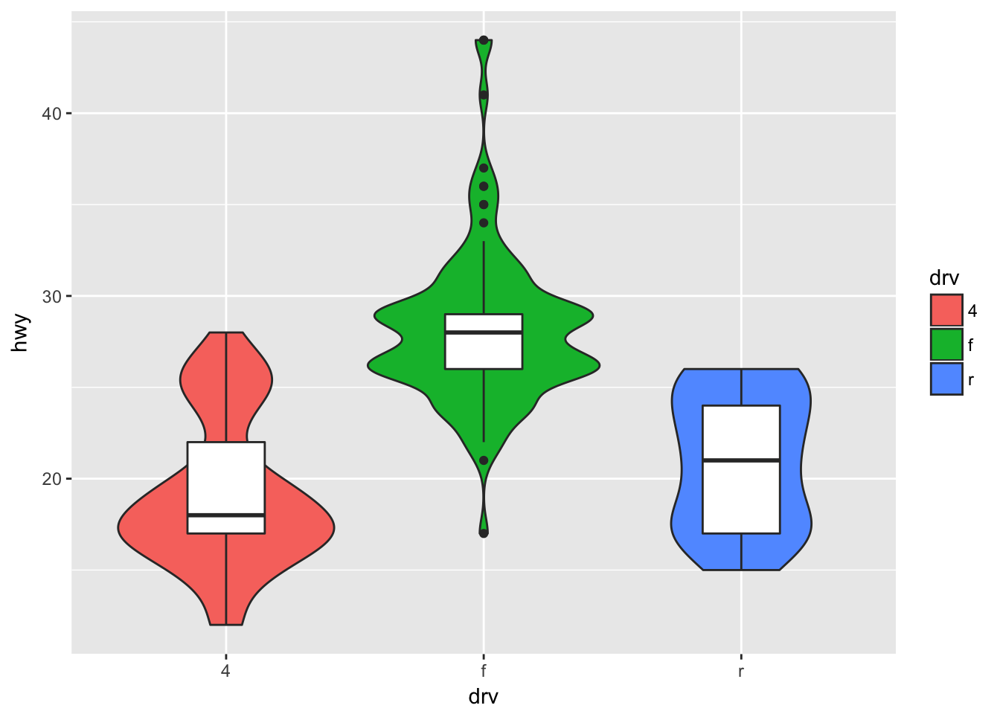


### Histogramas


```r
ggplot(mpg, aes(hwy)) + 
  geom_histogram(bins = 20)
```

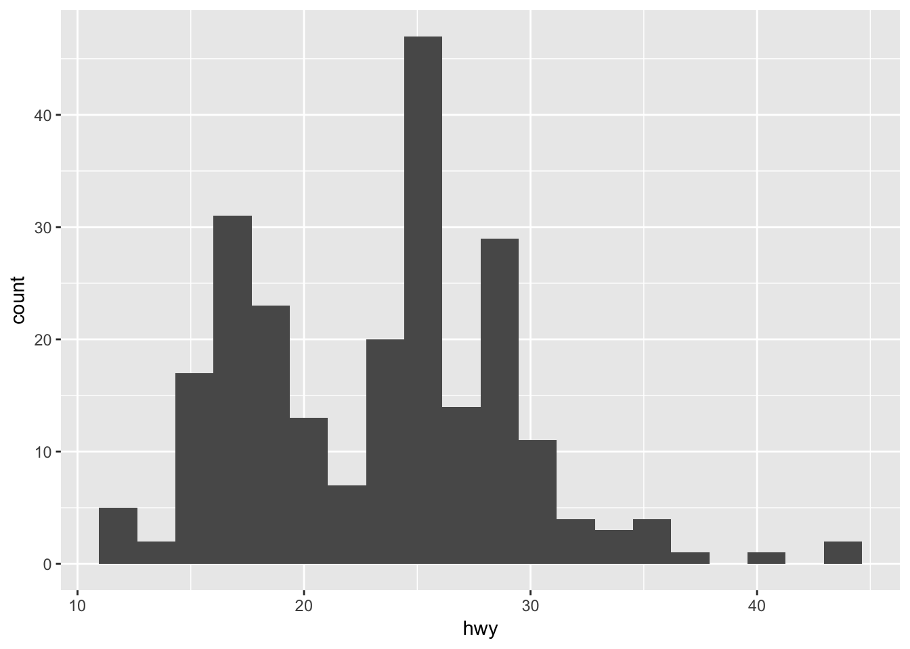


```r
ggplot(mpg, aes(displ)) + 
  geom_histogram(bins = 20)
```

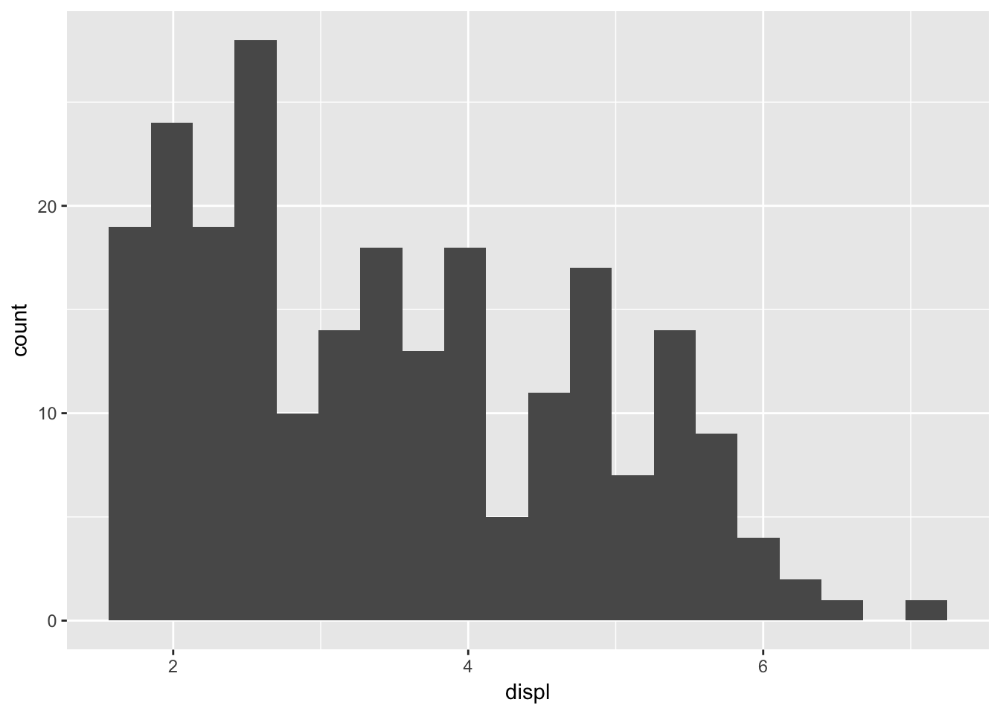


```r
ggplot(mpg, aes(hwy)) + 
  geom_density( color = "blue")
```

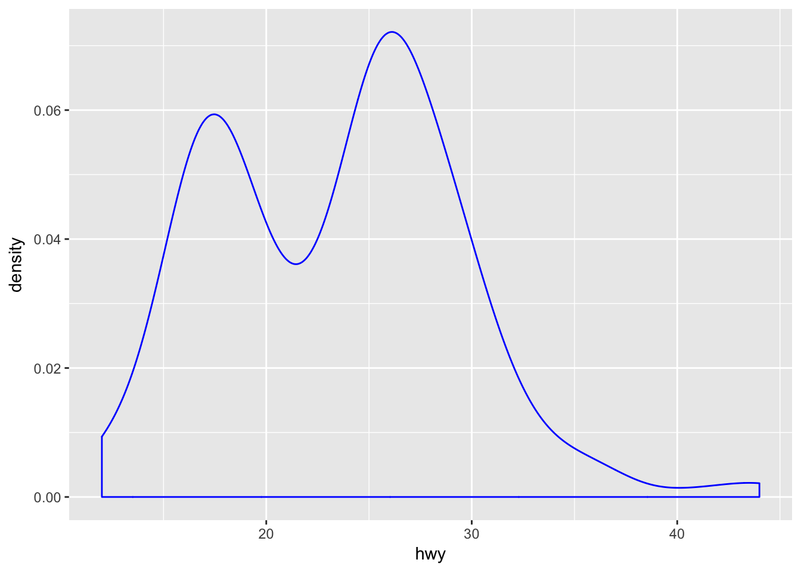


### Barras

Las gráficas de barras se generan con el 
objeto `geom_bar()`. Este es uno de los objetos
que hacen transformaciones estadísticas, en este caso 
en particular conteos.


```r
ggplot(mpg, aes(class)) + 
  geom_bar()
```


### Series de tiempo


```r
str(economics)
```

```
## Classes 'tbl_df', 'tbl' and 'data.frame':	574 obs. of  6 variables:
##  $ date    : Date, format: "1967-07-01" "1967-08-01" ...
##  $ pce     : num  507 510 516 513 518 ...
##  $ pop     : int  198712 198911 199113 199311 199498 199657 199808 199920 200056 200208 ...
##  $ psavert : num  12.5 12.5 11.7 12.5 12.5 12.1 11.7 12.2 11.6 12.2 ...
##  $ uempmed : num  4.5 4.7 4.6 4.9 4.7 4.8 5.1 4.5 4.1 4.6 ...
##  $ unemploy: int  2944 2945 2958 3143 3066 3018 2878 3001 2877 2709 ...
```


```r
class(economics$date)
```

```
## [1] "Date"
```


```r
summary(economics$date)
```

```
##         Min.      1st Qu.       Median         Mean      3rd Qu. 
## "1967-07-01" "1979-06-08" "1991-05-16" "1991-05-17" "2003-04-23" 
##         Max. 
## "2015-04-01"
```


```r
ggplot(economics, aes(date, unemploy/pop)) + 
  geom_line()
```

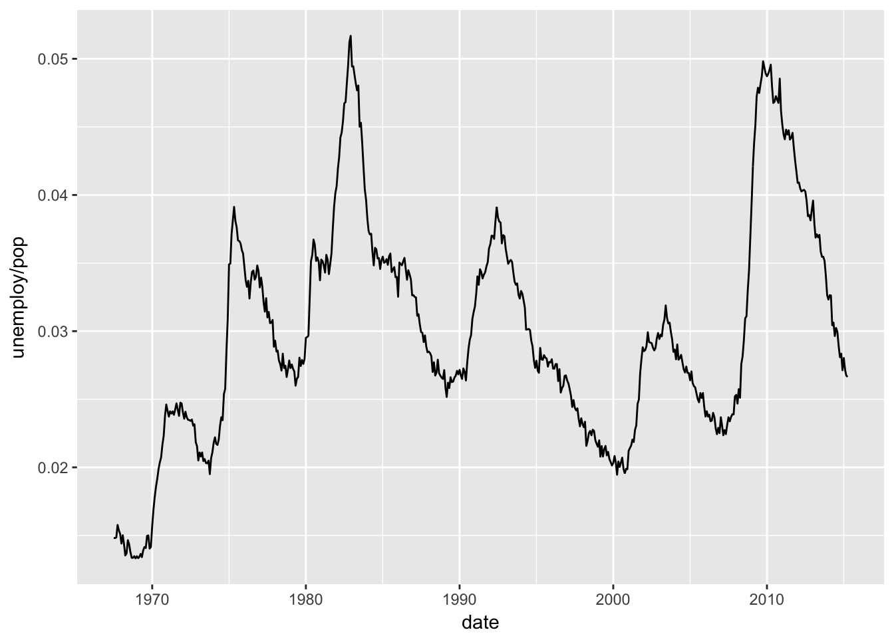


### Información estadística


#### QQ-Plot {-}

`stat_qq`

Realiza una gráfica cuantil-cuantil de 
una muestra y la distribución teórica. Por default
compara los cuantiles teóricos de la distribución
normal. 


```r
tab <-  data.frame(
  simulación = rexp(300, rate = 5)
)
ggplot(tab, aes(sample = simulación)) + 
      stat_qq()
```

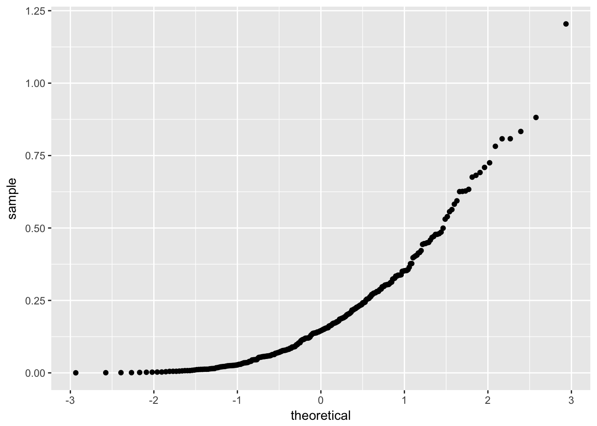

En el siguiente ejemplo se modifica para 
comparar con los cuantiles teóricos de la distribución 
exponencial. 


```r
ggplot(tab, aes(sample = simulación)) + 
      stat_qq(distribution = qexp, 
              dparams = 5, 
              color = 'gray40') 
```

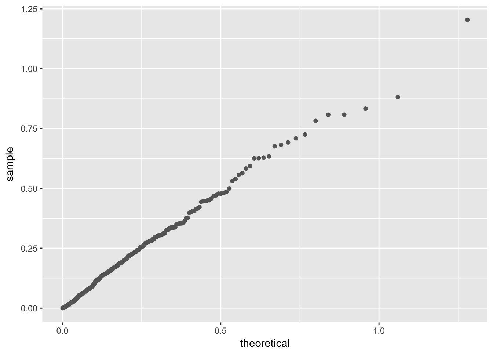


#### Distribución acumulada {-}

`stat_ecdf`

Este objeto realiza las transformaciones 
necesarias para presentar la distribución acumulada
de una muestra.

En la siguiente gráfica se compara
la distribución de simulaciones normales con distintos
parámetros.


```r
df <- data.frame(x = c(rnorm(100, 0, 3), 
                       rnorm(100, 0, 10)),
                 g = gl(2, 100))
ggplot(df, aes(x, colour = g)) + 
  stat_ecdf()
```

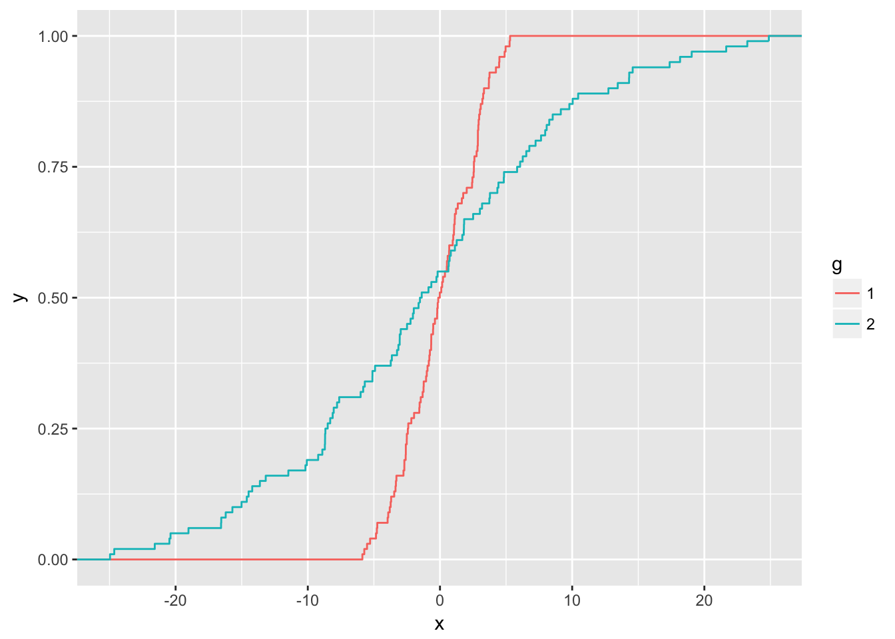


#### Distribución de función de probabilidad  {-}


`stat_function`

Este objeto permite graficar funciones en un 
rango determinado.

La siguiente gráfica
muestra una función predeterminada del 
objeto estadístico `dnorm`, que es la distribución
normal con media 2 y desviación 0.5.


```r
ggplot(data.frame(x = c(-5, 7)), aes(x)) + 
  stat_function(fun = dnorm, 
                args = list(mean = 2, sd = .5))
```


#### Distribución de función específica  {-}


`stat_function()` 

Es posible gráficar cualquier función, como 
en el siguiente ejemplo:


```r
sin_2_fun <- function(x){
  sin(x)^2
}
ggplot(data.frame(x = c(-10, 10)), aes(x)) + 
  stat_function(fun = sin_2_fun, size = 1, color = 'salmon')
```


<br>


## Facetting


```r
ggplot(mpg, aes(x = displ, y = hwy,
                color = class)) + 
  geom_point() + 
  facet_wrap(~class)
```

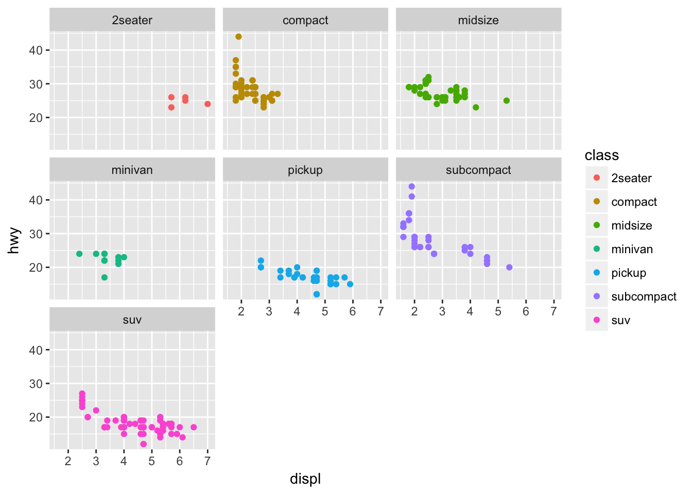


```r
ggplot(mpg, aes(x = displ, y = hwy,
                color = class)) + 
  geom_point() + 
  facet_wrap(~class, scales = "free_x")
```

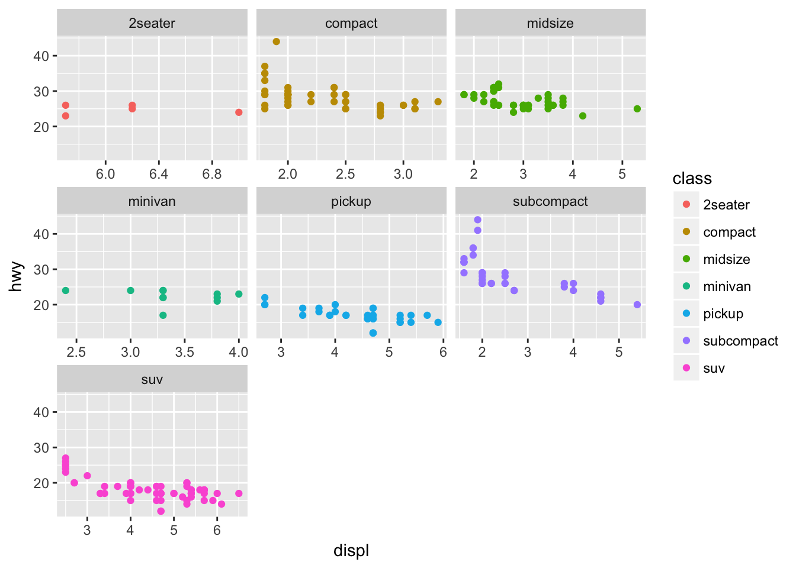


## Quick plots

Existe otra función para hacer gráficas rápidas: `qplot()`

\BeginKnitrBlock{nota}<div class="nota">`qplot()` crea gráficos "rápidos" o *quick plots* que permiten
graficar de forma muy sencilla y similar a `plot`.</div>\EndKnitrBlock{nota}


```r
qplot(x = displ, y = hwy, data = mpg)
```


```r
qplot(x = mpg$displ, y = mpg$hwy)
```

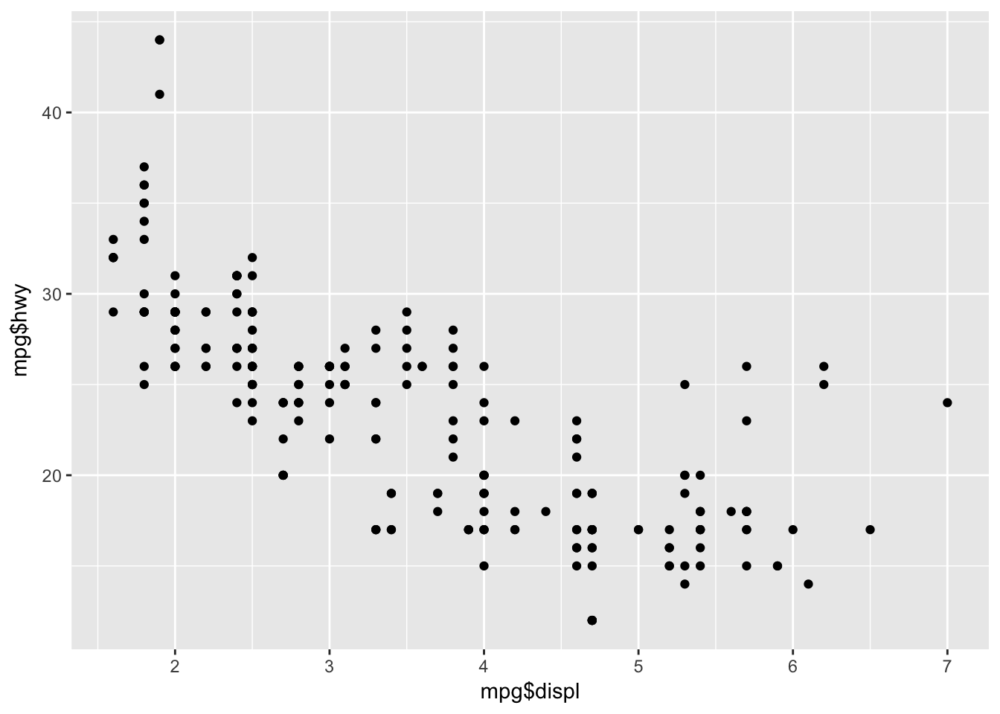


---

## Referencias


- **R for Data Visualization**. Capítulo 3. 
G. Growlemund and H. Wickham. 1st Edition. O'Reilly J. 2016.
http://r4ds.had.co.nz/data-visualisation.html

- **The Grammar of Graphics**. 
L. Wilkinson. 2nd Edition. Springer. 2016.
http://www.springer.com/gp/book/9780387245447


- **ggplot2: Elegant Graphics for Data Analysis**. 
H. Wickham. 2nd Edition. Springer. 2016.

- Referencia de objetos de ggplot2.
http://ggplot2.tidyverse.org/reference/

- Data Visualization with ggplot2 - Cheat Sheet. Agosto 2016. https://www.rstudio.com/wp-content/uploads/2015/03/ggplot2-cheatsheet.pdf
